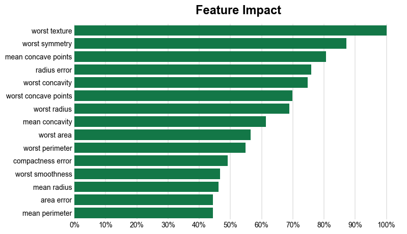
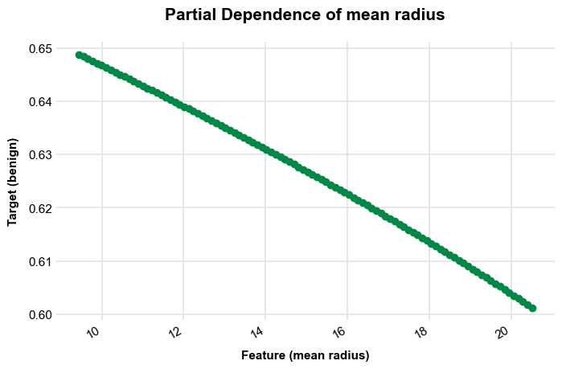

[](https://github.com/AndrewCarr24/automl_tool/actions/workflows/ci.yml)

### AutoML

This package provides tools for automating the process of machine learning model selection and hyperparameter tuning. These are tools I use when starting a new project. The `AutoML` class included in the package has methods to select a strong baseline model and produce feature importance and feature effects plots for model interpretation.

### Using the package 

Almost everything in this package can be accessed from the main class, `AutoML`. Start by initializing an instance of the class and using the `fit_pipeline` method to train and select a best estimator. I demonstrate this here with the breast cancer dataset from scikit-learn. This data is for modeling whether a tumor is malignant or benign using tumor attributes. The outcome equals 1 if the tumor is benign.


```python
from automl_tool.automl import AutoML
from sklearn.datasets import load_breast_cancer
from sklearn.model_selection import train_test_split
import pandas as pd 

# Load the dataset
data = load_breast_cancer()
X = pd.DataFrame(data.data, columns=data.feature_names)
y = pd.Series(data.target, name='benign')

# Split the dataset
X_train, X_test, y_train, y_test = train_test_split(X, y, test_size=0.2, random_state=42)

# Initialize and fit the AutoML estimator
automl = AutoML(X_train, y_train, "benign")
automl.fit_pipeline()

```

Running the `fit_pipeline` method fits a `GridSearchCV` meta-estimator, which uses a `Pipeline` to fit several models with different hyperparameters. After running the method, the selected model is stored as the `fitted_pipeline` attribute. 


```python
automl.fitted_pipeline
```

To obtain and plot feature importance scores, use the `get_feature_importance_scores` and `plot_feature_importance_scores` methods. The plot is stored as the `feature_importance_plot` attribute. You can specify the `top_k` parameter to limit the features shown in the plot to the k most important features. 


```python
automl.get_feature_importance_scores()
automl.plot_feature_importance_scores(top_k=15)
automl.feature_importance_plot
```


    

    


To assess how features are related to the outcome, you can generate feature effects, or partial dependence plots, using the `get_partial_dependence_plots` method. These plots are stored as a dictionary, the `partial_dependence_plots` attribute.


```python
automl.get_partial_dependence_plots()
automl.partial_dependence_plots
```


    {'mean radius': <Figure size 800x450 with 1 Axes>,
     'mean texture': <Figure size 800x450 with 1 Axes>,
     'mean perimeter': <Figure size 800x450 with 1 Axes>,
     'mean area': <Figure size 800x450 with 1 Axes>,
     'mean smoothness': <Figure size 800x450 with 1 Axes>,
     'mean compactness': <Figure size 800x450 with 1 Axes>,
     'mean concavity': <Figure size 800x450 with 1 Axes>,
     'mean concave points': <Figure size 800x450 with 1 Axes>,
     'mean symmetry': <Figure size 800x450 with 1 Axes>,
     'mean fractal dimension': <Figure size 800x450 with 1 Axes>,
     'radius error': <Figure size 800x450 with 1 Axes>,
     'texture error': <Figure size 800x450 with 1 Axes>,
     'perimeter error': <Figure size 800x450 with 1 Axes>,
     'area error': <Figure size 800x450 with 1 Axes>,
     'smoothness error': <Figure size 800x450 with 1 Axes>,
     'compactness error': <Figure size 800x450 with 1 Axes>,
     'concavity error': <Figure size 800x450 with 1 Axes>,
     'concave points error': <Figure size 800x450 with 1 Axes>,
     'symmetry error': <Figure size 800x450 with 1 Axes>,
     'fractal dimension error': <Figure size 800x450 with 1 Axes>,
     'worst radius': <Figure size 800x450 with 1 Axes>,
     'worst texture': <Figure size 800x450 with 1 Axes>,
     'worst perimeter': <Figure size 800x450 with 1 Axes>,
     'worst area': <Figure size 800x450 with 1 Axes>,
     'worst smoothness': <Figure size 800x450 with 1 Axes>,
     'worst compactness': <Figure size 800x450 with 1 Axes>,
     'worst concavity': <Figure size 800x450 with 1 Axes>,
     'worst concave points': <Figure size 800x450 with 1 Axes>,
     'worst symmetry': <Figure size 800x450 with 1 Axes>,
     'worst fractal dimension': <Figure size 800x450 with 1 Axes>}


```python
automl.partial_dependence_plots["mean radius"]
```


    

    


### Time Series Forecasting Benchmark

AutoML includes time series forecasting capabilities. The table below compares AutoML's performance against Prophet and sktime on a variety of synthetic and real-world time series (24-month holdout, MAE metric). See the [notebook](misc/compare_automl_prophet_sktime.ipynb) for details:

| Series | Type | AutoML MAE | Prophet MAE | sktime MAE | Winner |
|--------|------|------------|-------------|------------|--------|
| Seasonal+Trend | Synthetic | 1.76 | 1.91 | 1.57 | sktime |
| Linear Trend | Synthetic | 2.18 | 2.23 | 2.15 | sktime |
| Quadratic | Synthetic | 1.54 | 12.32 | 1.44 | sktime |
| Logistic (S-curve) | Synthetic | 2.50 | 2.87 | 2.32 | sktime |
| Random Walk (drift) | Synthetic | 0.72 | 1.69 | 1.48 | automl |
| Piecewise (changepoints) | Synthetic | 1.92 | 1.91 | 2.97 | prophet |
| Spiky Intermittent | Synthetic | 1.67 | 1.64 | 1.66 | prophet |
| Multi-seasonal | Synthetic | 1.46 | 1.40 | 1.58 | prophet |
| CO2 | Real (statsmodels) | 0.25 | 0.37 | 0.29 | automl |
| CPIAUCSL | Real (FRED) | 0.44 | 1.53 | 2.90 | automl |
| UNRATE | Real (FRED) | 0.12 | 0.28 | 0.17 | automl |
| INDPRO | Real (FRED) | 0.46 | 0.72 | 1.66 | automl |
| **Average** | | **1.25** | **2.41** | **1.68** | **automl** |

AutoML is competitive with dedicated time series packages, particularly on real-world economic data (FRED series), where it consistently outperforms both Prophet and sktime.

```python

```
